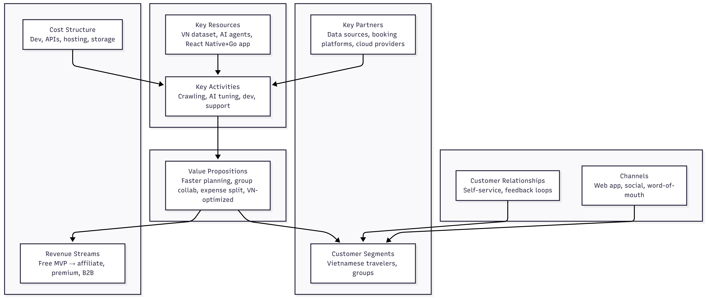
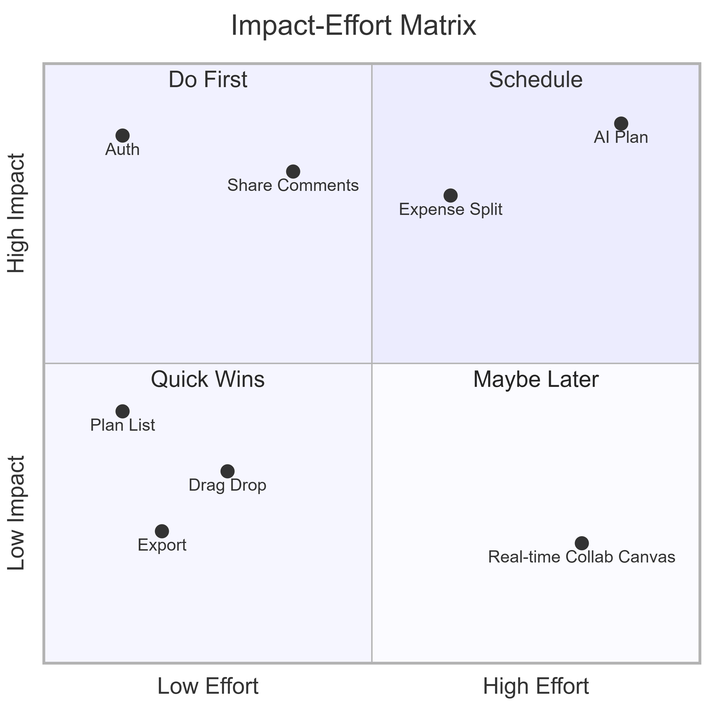
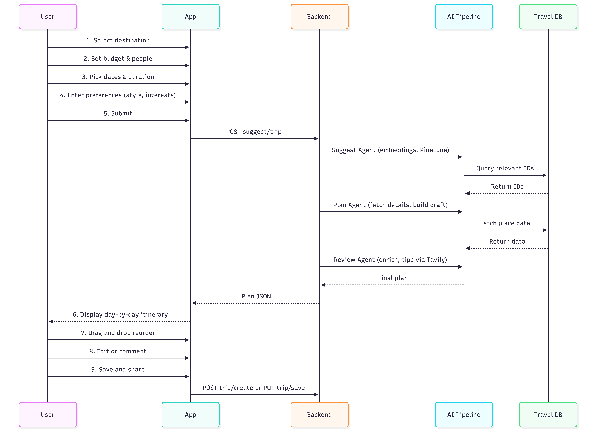
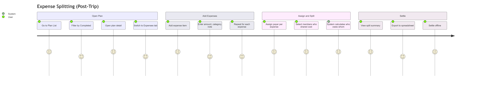

# Trip Planner — Project Wiki

> **Navigation**: [Project Overview](#1-project-overview) | [Market Research](#2-market-research) | [Business Canvas](#3-business-canvas) | [MVP Features](#4-mvp-features) | [User Flows](#5-user-flows) | [Agent Flow](#7-agent-flow)

---

## 1. Project Overview

### Project Name
**Trip Planner**

### Project Slogan
*"Plan smarter. Travel together. Split fairly."*

### Purpose
Trip Planner is a web application that helps Vietnamese users create, customize, and manage travel itineraries with minimal effort. It addresses the pain of manual research, scattered planning tools, and post-trip expense splitting.

### Project Goals
- **Reduce planning time**: Replace hours of Googling and social media research with AI-powered recommendations based on a curated Vietnamese dataset.
- **Support group travel**: Enable sharing, commenting, and collaborative editing so plans satisfy multiple preferences (e.g., "9 người 10 ý").
- **End-to-end experience**: Cover pre-trip (planning), during-trip (itinerary), and post-trip (expense splitting) in one place.
- **Optimize for Vietnam**: Use locally crawled data (Google Maps, Foody, Booking, Pasgo, Hanoi tourist sites) for relevant, accurate suggestions.

---

## 2. Market Research

### 2.1 Similar Products

| # | Product | Type | Target Market | Vietnamese Database | Key Features |
|---|---------|------|---------------|---------------------|--------------|
| 1 | **Google Trips / Google Travel** | Web/App | Global | Limited VN-specific content | Itinerary suggestions, reservations, maps |
| 2 | **TripAdvisor** | Web/App | Global | Some VN listings, mostly tourist hotspots | Reviews, bookings, forums |
| 3 | **Klook** | Web/App | Asia-Pacific | VN activities available but not deep | Activities, tours, tickets |
| 4 | **Inspitrip** | Web/App | Vietnam-focused | Strong VN focus | Local tours, experiences |
| 5 | **Traveloka** | Web/App | Southeast Asia | VN flights, hotels, activities | Booking, some planning |
| 6 | **Wanderlog** | Web/App | Global | Minimal VN optimization | Collaborative trip planning, maps |

### 2.2 Comparison Table

| Criteria | Trip Planner (Ours) | Google Travel | TripAdvisor | Klook | Inspitrip | Wanderlog |
|----------|---------------------|---------------|-------------|-------|-----------|-----------|
| **Vietnamese database** | ✅ Crawled from Foody, GG Maps, Pasgo, Booking, Hanoi tourist | ⚠️ Generic | ⚠️ Tourist-heavy | ⚠️ Limited | ✅ Good | ❌ Minimal |
| **AI itinerary generation** | ✅ Yes | ⚠️ Basic | ❌ No | ❌ No | ❌ No | ⚠️ Limited |
| **Group sharing & comments** | ✅ Yes, per-activity | ⚠️ Limited | ❌ No | ❌ No | ❌ No | ✅ Yes |
| **Expense splitting** | ✅ Yes | ❌ No | ❌ No | ❌ No | ❌ No | ❌ No |
| **E2E (plan → book → split)** | ⚠️ Plan + split (booking roadmap) | ⚠️ Partial | ⚠️ Partial | ✅ Booking focus | ⚠️ Tours only | ❌ Plan only |
| **Collaborative editing** | ✅ Comments + AI suggestions | ❌ No | ❌ No | ❌ No | ❌ No | ✅ Yes |
| **Free / low cost** | ✅ Yes | ✅ Yes | ✅ Yes | ✅ Yes | ✅ Yes | ✅ Yes |

### 2.3 Insights & Gaps

- **Vietnamese database gap**: Most global tools (Google Travel, TripAdvisor, Wanderlog) rely on generic or tourist-centric data. Local platforms (Inspitrip, Foody) have better VN coverage but lack AI planning and expense splitting. **Opportunity**: A product with a dedicated VN dataset (places, food, hotels) + AI + group features.
- **Group planning friction**: "9 người 10 ý" is common; existing tools rarely support comments per activity and AI-driven compromise suggestions. **Opportunity**: Per-activity comments + AI-generated alternatives that satisfy most feedback.
- **Post-trip pain**: Expense splitting is usually done manually (Excel, Zalo, cash). No major travel app integrates this. **Opportunity**: Built-in bill splitting tied to the same trip plan.
- **E2E experience**: Users juggle multiple apps (planning, booking, splitting). **Opportunity**: One app for planning and splitting, with future booking integration.

---

## 3. Business Canvas

| Block | Description |
|-------|-------------|
| **Key Partners** | Data sources (Google Maps, Foody, Booking), future booking platforms, cloud providers (Pinecone, Tavily) |
| **Key Activities** | Data crawling & curation, AI model tuning, product development, user support |
| **Key Resources** | Vietnamese travel dataset, AI agents (Suggest, Plan, Review), web app (React + Go) |
| **Value Propositions** | Faster planning, group-friendly collaboration, expense splitting, Vietnam-optimized recommendations |
| **Customer Relationships** | Self-service web app, feedback loops via comments, future community features |
| **Channels** | Web app, social media, word-of-mouth, university/assignment demos |
| **Customer Segments** | Vietnamese travelers (individuals & groups), especially those planning domestic trips |
| **Cost Structure** | Development time, API costs (Pinecone, Tavily, maps), hosting, data storage |
| **Revenue Streams** | Free MVP; future: affiliate/booking commissions, premium features, B2B API |

---

## 4. MVP Features

### Key Resource: Web Version Demo

We have a **working web app** as our MVP foundation. The assignment goal is to extend this into a **mobile app** (React Native).

**Video demo (web version):** [https://youtu.be/jjYC0ocranI](https://youtu.be/jjYC0ocranI)

**API documentation (Swagger):** [https://travelplan.vercel.app/swagger.html](https://travelplan.vercel.app/swagger.html)

This existing web implementation (React + Go + AI) serves as our key resource: proven flows, API contracts, and AI integration can be reused when building the mobile client.

### 4.1 Impact–Effort Matrix

### 4.2 Prioritized MVP Features

| Priority | Feature | Impact | Effort | Why for First Release |
|----------|---------|--------|--------|------------------------|
| **P1** | **User authentication (Sign up / Sign in)** | High | Low | Required for saving plans, sharing, and expense tracking. Foundation for all user-specific features. |
| **P2** | **AI-powered itinerary generation** | High | High | Core differentiator. Uses Vietnamese dataset + user preferences to generate plans. Reduces manual research time. |
| **P3** | **Plan sharing & per-activity comments** | High | Medium | Addresses "9 người 10 ý". Enables group feedback; master can trigger AI to suggest alternatives. |
| **P4** | **Expense tracking & bill splitting** | High | Medium | Solves post-trip pain. Differentiates from competitors. Completes E2E value proposition. |
| **P5** | **Plan list & day-by-day view** | Medium | Low | Essential UX for viewing and managing plans. Already in scope. |
| **P6** | **Drag-and-drop reorder** | Medium | Low | Improves customization without heavy development. |
| **P7** | **Export (spreadsheet / screenshot)** | Medium | Low | Useful for offline use and sharing outside the app. |

### 4.3 Why These for MVP

- **Auth**: No auth = no persistent plans, no sharing, no splitting. Must be first.
- **AI plan generation**: Main value proposition; without it, the product is just a generic planner.
- **Sharing & comments**: Targets group travel pain; aligns with Vietnamese group travel behavior.
- **Expense splitting**: Closes the loop from planning to post-trip; rarely offered by competitors.
- **Plan list, reorder, export**: High value for effort; improve usability with limited extra work.

---

## 5. User Flows

### 5.1 User Flow 1: Sign Up & Sign In

**Steps:**
1. User visits app → sees landing/home.
2. Clicks "Sign Up" → enters email, password.
3. (Optional) Email verification.
4. Redirected to dashboard / plan list.
5. Returning user: "Sign In" → email, password → dashboard.

---

### 5.2 User Flow 2: Create AI-Powered Trip Plan

**Steps:**
1. User clicks "Create New Plan".
2. Selects destination (from predefined or search).
3. Sets budget and number of travelers.
4. Picks travel dates and duration.
5. Enters preferences (travel style, interests, dietary needs, etc.).
6. Submits → AI generates itinerary using Vietnamese dataset.
7. User reviews plan, drag-and-drops to reorder, edits if needed.
8. Saves plan; optionally shares with group.

---

### 5.3 User Flow 3: Expense Tracking & Bill Splitting (Post-Trip)

**Steps:**
1. User opens a completed trip plan.
2. Navigates to "Expenses" or "Split Bill".
3. Adds expenses (amount, category, description).
4. Assigns payer and beneficiaries (who shared the cost).
5. System calculates who owes whom.
6. User views summary; can export for offline settlement.

---

## 6. Wiki Structure & Navigation

| Page | Content |
|------|---------|
| [Project Overview](#1-project-overview) | Name, slogan, purpose, goals |
| [Market Research](#2-market-research) | 6 similar products, comparison table, Vietnamese database focus, gaps |
| [Business Canvas](#3-business-canvas) | Canvas blocks as table |
| [MVP Features](#4-mvp-features) | Impact–Effort Matrix, prioritized list, rationale |
| [User Flows](#5-user-flows) | Sign up/Sign in, Create AI Plan, Expense splitting |
| [Agent Flow](#7-agent-flow) | AI pipeline (Suggest, Plan, Review agents) |

---

## 7. Agent Flow

How the AI pipeline generates and refines travel plans:

### Flow Overview

1. **User Input** → Users provide preferences (style, budget, session, etc.) to the **Suggest Agent**.
2. **Suggest Agent** → Generates embeddings, queries **Pinecone** (vector DB) for relevant travel IDs.
3. **Plan Agent** → Fetches detail data from the **Travel Database**, creates draft plan.
4. **Review Agent** → Reviews draft, searches travel tips via **Tavily**, produces final plan.
5. **User Review** → Users view plan, comment, or request alternative activities.
6. **Plan Agent (Edit)** → Incorporates feedback, fetches more activities from Pinecone, returns edited plan.

### Key Components

| Component | Role |
|-----------|------|
| **Suggest Agent** | Embedding and initial recommendation |
| **Plan Agent** | Data retrieval, plan creation, and editing |
| **Review Agent** | Plan review, enrichment, finalization |
| **Pinecone** | Vector database for semantic search |
| **Tavily** | External search for travel tips |
| **Travel Database** | Source of place, accommodation, restaurant data |

---

*Last updated: January 2025*
